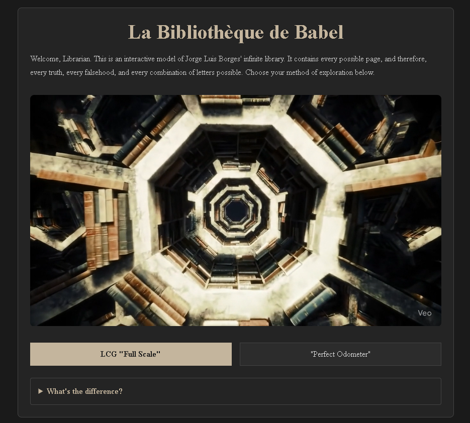
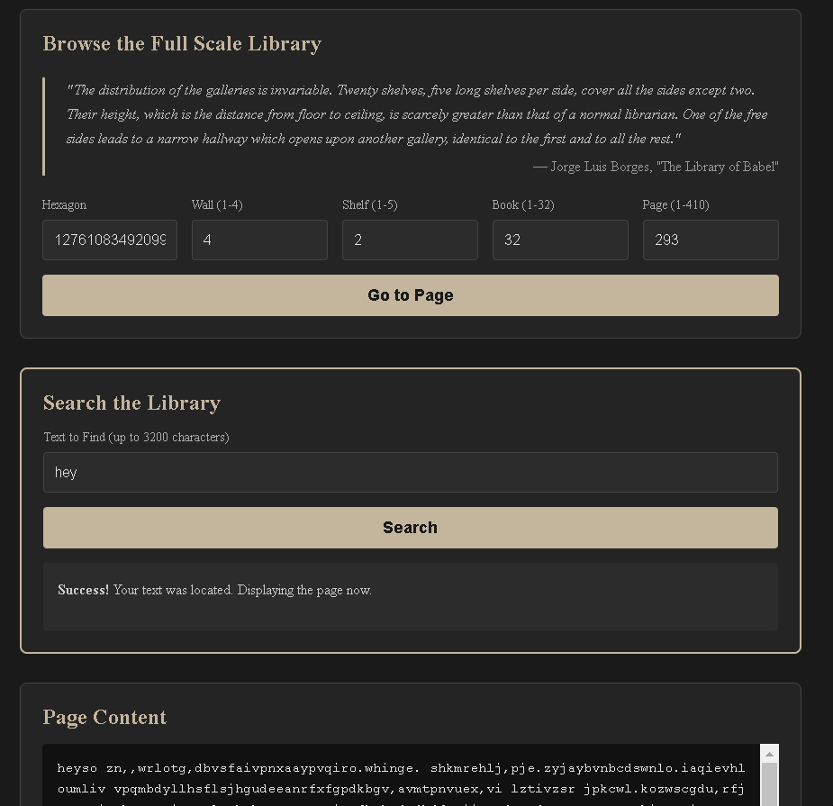

# The Digital Library of Babel: An Interactive Exploration

This project is a fully interactive, web-based implementation of Jorge Luis Borges' famous short story, "The Library of Babel." It provides a hands-on experience of the concepts of infinity, language, and order versus chaos, allowing users to browse and search a virtual library that contains every possible text.

The application is built with a modern web stack and features two distinct, switchable implementations of the library, each with its own philosophical and algorithmic foundation.

 

## Features

 

*   **Dual Implementations:** Seamlessly switch between two different library models:
    1.  **LCG "Full Scale" Method:** A simulation of a chaotic, pseudo-random, and practically infinite universe, mirroring the feel of Borges' original story.
    2.  **"Perfect Odometer" Method:** A perfectly ordered, finite library where every possible text has a unique, calculable address.
*   **Authentic "Full Scale" Experience:** The LCG mode uses the canonical dimensions from the story (410 pages, 80x40 character grid) and operates within an astronomical 128-bit number space, making the search a true demonstration of the story's scale.
*   **Guaranteed "Perfect" Search:** The Odometer mode can instantly find the precise location of *any* text up to its 300-character limit.
*   **Interactive UI:** A professional, user-friendly interface built with Next.js and React, featuring a dark theme, responsive design, and clear, explanatory text.
*   **Self-Hosted Video:** An ambient, auto-playing video introduction hosted directly within the project assets for a seamless user experience.
*   **Educational Content:** The UI includes an "About" page and in-line explanations detailing the concepts, the differences between the two methods, and quotes from the original story.


## Technical Architecture

The application is a modern full-stack project with a clear separation between the frontend and backend.

### Backend

*   **Framework:** **Node.js** with **Express.js**
*   **Core Logic:** All the heavy mathematical lifting for both library implementations resides in a single `babel.js` module.
*   **Large Number Arithmetic:** All calculations use JavaScript's native **`BigInt`** data type to handle the massive numbers required for the state space and addresses.
*   **API:** A simple RESTful API with four main endpoints to serve page content and search results for each of the two library modes.

### Frontend

*   **Framework:** **Next.js** with **React**
*   **Styling:** **CSS Modules** (`globals.css`) for a dark theme, responsive design, and custom fonts. No external CSS libraries are used.
*   **State Management:** Client-side state is handled using React Hooks (`useState`, `useCallback`).
*   **User Interface:** The UI is designed to be clean, professional, and educational, with clear labels, placeholders, and dynamic content that adapts to the selected library mode.

## Getting Started: Installation and Setup

To run this project on your local machine, you will need to have Node.js (version 18 or later) and `npm` installed.

#### 1. Clone the Repository

First, clone this project to your local machine.
```bash
git clone https://github.com/Eng-Mahmoud-Abdrabbou/La-Bibliotheque-de-Babel.git
cd La-Bibliotheque-de-Babel
```

#### 2. Set Up the Backend

The backend server is responsible for all the calculations.
```bash
# Navigate to the backend directory
cd Backend

# Install the required dependencies (express, cors)
npm install

# Start the backend server
npm start
```
The backend will now be running on `http://localhost:3001`. You can leave this terminal open.

#### 3. Set Up the Frontend

The frontend is the user interface you interact with in the browser.
```bash
# Open a NEW terminal window and navigate to the frontend directory
cd Frontend

# Install the required dependencies (react, next)
npm install

# Start the frontend development server
npm run dev
```
Your default web browser should automatically open to `http://localhost:3000`.

You now have the complete application running locally.

## How to Use the Application

1.  **Choose a Mode:** Use the buttons at the top of the main page to switch between the **LCG "Full Scale"** and **"Perfect Odometer"** implementations.
2.  **Browse:**
    *   In **LCG Mode**, enter an address using the Hexagon, Wall, Shelf, Book, and Page inputs. The page numbers follow the canonical dimensions described in the Borges quote.
    *   In **Perfect Mode**, enter any large number into the "Page ID" input.
3.  **Search:**
    *   Enter any string of text into the main search bar.
    *   In **Perfect Mode**, the result will be instantaneous and guaranteed.
    *   In **LCG Mode**, the search will attempt to find your string. Short strings (1-6 characters) will be found quickly. Longer strings will cause a noticeable delay and will likely time out, which is the intended behavior of this simulation. The application will provide a clear message explaining this phenomenon.

## Project Structure

```
La-Bibliothèque-de-Babel
├── Backend/
│   ├── server.js         # The Express API server
│   ├── babel.js          # Core logic for both library implementations
│   └── package.json
│
└── Frontend/
    ├── app/
    │   ├── page.js       # The main interactive library page component
    │   ├── about/
    │   │   └── page.js   # The component for the "About" page
    │   ├── layout.js     # The root layout with navbar and footer
    │   └── globals.css   # The global stylesheet for the entire app
    ├── public/
    │   └── library_demo.mp4 # Location for the self-hosted video
    └── package.json
```

## Acknowledgements

This project is a tribute to the genius of **Jorge Luis Borges**, whose story "The Library of Babel" continues to inspire programmers, mathematicians, and thinkers around the world.

---
